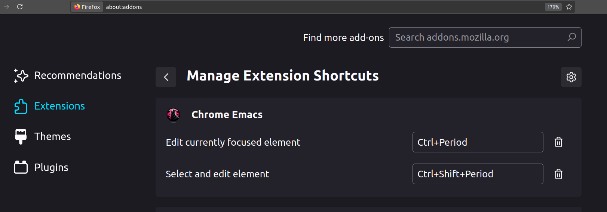
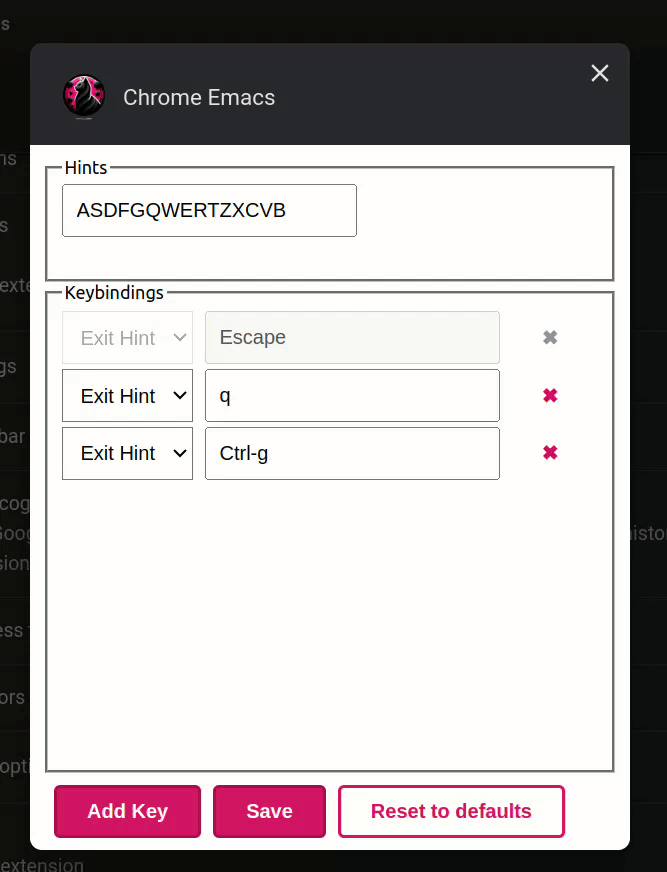
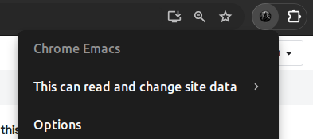
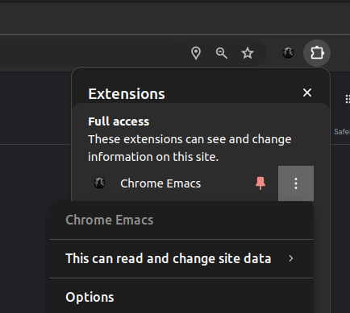
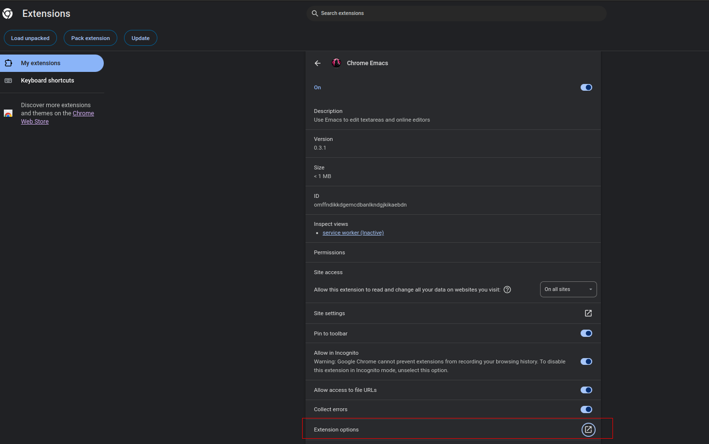

# About

<div align="center">


</div>

This [Chrome Extension](https://chromewebstore.google.com/detail/chrome-emacs/dabdpcafiblbndpoadckibiaojbdnpjg) and [Firefox add-on](https://addons.mozilla.org/en-US/firefox/addon/chrome-emacs) are focused on bi-directional editing in online text editors and text areas from within Emacs.

After the original Atomic Chrome extension was removed from the Chrome Web Store due to policy violations, I undertook the task of creating an entirely refreshed and compliant version. Now named "Chrome Emacs," it represents more than just a fork; it is a comprehensive rewrite that adheres to the newest standards and Chrome Extension Manifest V3, ensuring both compliance and enhanced security.

Differences between the original and the forked package, as well as other similar packages, like [GhostText](https://github.com/fregante/GhostText/tree/main):

- **Support for the Monaco Editor**: Expands the range of compatible online editors far beyond the original. Note, GhostText also supports the Monaco Editor but without position and scroll synchronization.
- **Editable Areas Navigation with Hints**: Introduces a navigation feature where editable areas are overlaid with hints (letters). Pressing the corresponding letter key on the keyboard allows users to swiftly switch focus to those areas, enhancing usability and editing efficiency.
- **Migration to Chrome Extension Manifest V3**: Guarantees that the extension stays compatible with the latest browser versions and meets current security standards.
- **Cursor and Scroll Synchronization**: The motivation for this comes from the live-coding experience during online interviews. Unlike other solutions, it focuses not only on editing text areas but also on providing a seamless live-code experience in online editors.
- **Auto-Major Mode Detection**: Automatically configures the most suitable editing mode for any given online editor.
- **Complete Rewrite in TypeScript**: This enhances the extension's stability, maintainability, and performance.


Chrome Emacs is compatible with almost all online editors, including:

- ☑ [codepen.io](https://codepen.io/)
- ☑ [stackblitz.com](https://stackblitz.com/)
- ☑ [jsfiddle.net](https://jsfiddle.net/)
- ☑ [leetcode.com](https://leetcode.com/)
- ☑ [hackerrank.com](https://www.hackerrank.com/)
- ☑ [repl.it](https://repl.it/)
- ☑ [glitch.com](https://glitch.com/)
- ☑ [plnkr.co](https://plnkr.co/)
- ☑ [coderpad.io](https://coderpad.io/)

Experimental support is also available. See key considerations for users [here](https://github.com/KarimAziev/chrome-emacs/blob/main/docs/experimental-monaco-support.md):

- ☑ [vscode.dev](https://vscode.dev/)
- ☑ [codesandbox.io](https://codesandbox.io/)

Basic support (without scroll synchronization) for some rich text editors is also included:

- ☑ [CKEditor 4](https://ckeditor.com/ckeditor-4/)
- ☑ [CKEditor 5](https://ckeditor.com/ckeditor-5/)
- ☑ [TinyMCE](https://www.tiny.cloud) and other iframe-based editors.
- ☑ [Slack](https://slack.com/) and other [Quill](https://quilljs.com/)-based editors.

<!-- markdown-toc start - Don't edit this section. Run M-x markdown-toc-refresh-toc -->

**Table of Contents**

> - [About](#about)
> - [Installation](#installation)
>   - [Browser Extension](#browser-extension)
>   - [Emacs Integration](#emacs-integration)
>     - [With use-package and straight.el](#with-use-package-and-straightel)
>     - [Manual Installation](#manual-installation)
>     - [Run server](#run-server)
> - [Usage](#usage)
> - [Customization](#customization)
>   - [How to Bind Shortcuts](#how-to-bind-shortcuts)
>     - [Chrome](#chrome)
>     - [Firefox](#firefox)
>   - [Extension Options](#extension-options)
>     - [Chrome](#chrome-1)
>       - [From the Toolbar with a Pinned Icon](#from-the-toolbar-with-a-pinned-icon)
>       - [From the Toolbar without a Pinned Icon](#from-the-toolbar-without-a-pinned-icon)
>       - [From the Chrome Extensions URL](#from-the-chrome-extensions-url)
>     - [Firefox](#firefox-1)
>       - [From the Toolbar with a Pinned Icon](#from-the-toolbar-with-a-pinned-icon-1)
>       - [From the Toolbar without a Pinned Icon](#from-the-toolbar-without-a-pinned-icon-1)
>       - [From the Firefox Add-ons Manager](#from-the-firefox-add-ons-manager)
>   - [Simulating Clicks](#simulating-clicks)
> - [Development](#development)

<!-- markdown-toc end -->

# Installation

## Browser Extension

Install the [Chrome Extension](https://chromewebstore.google.com/detail/chrome-emacs/dabdpcafiblbndpoadckibiaojbdnpjg) or [Firefox add-on](https://addons.mozilla.org/en-US/firefox/addon/chrome-emacs).

## Emacs Integration

Install the corresponding Emacs package from <a target="_blank" href="https://github.com/KarimAziev/atomic-chrome">this fork</a> (recommended for cursor and scroll synchronization, file handling, automatic major mode detection, and handling large content, etc.), or the original <a href="https://github.com/alpha22jp/atomic-chrome" target="_blank">atomic-chrome</a> package for basic functionality only.

<details><summary> Detailed Differences Between the Original Package and Its Fork
  </summary>

- **Handling large payloads:** Unlike the original package, which may not handle incomplete frames, this fork is equipped to manage large payloads efficiently.
- **Cursor and scroll synchronization:** Inspired by the need for a more fluid live-coding experience during online interviews, the [chrome-emacs](https://github.com/KarimAziev/chrome-emacs) extension and this fork focus on editing text areas and providing seamless cursor and scroll synchronization in online editors.
- **Flexible file handling:** This fork introduces the `atomic-chrome-create-file-strategy` variable, enabling refined control over the use of temporary files for editing—a feature not present in the original package. Recognizing that language servers often require file access for functionalities like code linting and autocompletion, this feature allows users to enable, disable, or customize file usage according to their needs. This flexibility ensures users have full control over their editing environment.
- **Dynamic major modes:** Recognizing the diversity of programming languages within many online editors, this fork surpasses the original package's limitation of one major mode per website. It dynamically sets major modes based on file extensions extracted from the editor instance, resulting in a more responsive and tailored editing experience.
- **Enhanced frame configuration:** Beyond the original package's limited customization of frame width and height, this fork extends customization to every frame configuration parameter. It also automatically calculates `left` and `top` positions for the frame when the Atomic Chrome client provides a `rect` with pixel dimensions and positions, offering a more adaptable and sophisticated user interface.

</details>

<details><summary> Show installation instructions
  </summary>

### With use-package and straight.el

```emacs-lisp
(use-package atomic-chrome
  :demand t
  :straight (atomic-chrome
             :repo "KarimAziev/atomic-chrome"
             :type git
             :host github)
  :commands (atomic-chrome-start-server)
  :config
  (setq-default atomic-chrome-extension-type-list '(atomic-chrome))
  (atomic-chrome-start-server))
```

### Manual Installation

Download the source code and place it in your desired directory (e.g., `~/.emacs.d/atomic-chrome/`):

```
git clone https://github.com/KarimAziev/atomic-chrome.git ~/.emacs.d/atomic-chrome/
```

Add the downloaded directory to the load path and require it:

```emacs-lisp
(add-to-list 'load-path "~/.emacs.d/atomic-chrome/")
(require 'atomic-chrome)
```

### Run server

```emacs-lisp
(atomic-chrome-start-server)
```

</details>

<details><summary> Show Emacs advanced configuration example with deferred loading
  </summary>

Below is an example configuration that demonstrates deferred (lazy) loading of `atomic-chrome`. The server's loading and startup are delayed until the first focus change of the Emacs frame (e.g., when you switch to the browser).

```emacs-lisp
(use-package atomic-chrome
  :defer t
  :init
  (defvar km-atomic-chrome-first-frame-changed nil
    "Non-nil if a frame focus change occurred after Emacs started.
Tracks whether to defer `atomic-chrome' server startup until the first focus
change.")
  (defun km-atomic-chrome-run-server-after-focus-change (&rest _)
    "Start Atomic Chrome server upon graphical frame focus change.

For GUI sessions:
- The server is started only on the second focus change event (the first one
  is triggered immediately after Emacs starts).
- After starting the server, this function removes itself from
  `after-focus-change-function' to avoid further overhead.

In terminal (`tty') environments, it disables itself immediately since focus
changes are not applicable."
    (let ((frame (selected-frame)))
      (if (tty-top-frame frame)
          (remove-function after-focus-change-function
                           'km-atomic-chrome-run-server-after-focus-change)
        (when (frame-parameter frame 'last-focus-update)
          (if (not km-atomic-chrome-first-frame-changed)
              (setq km-atomic-chrome-first-frame-changed t)
            (remove-function after-focus-change-function
                             'km-atomic-chrome-run-server-after-focus-change)
            (require 'atomic-chrome)
            (when (fboundp 'atomic-chrome-start-server)
              (atomic-chrome-start-server)))))))
  (add-function :after after-focus-change-function
                'km-atomic-chrome-run-server-after-focus-change)
  :straight (atomic-chrome
             :type git
             :flavor nil
             :host github
             :repo "KarimAziev/atomic-chrome")
  :defines atomic-chrome-create-file-strategy
  :config
  (setq-default atomic-chrome-buffer-open-style 'frame)
  (setq-default atomic-chrome-auto-remove-file t)
  (setq-default atomic-chrome-url-major-mode-alist
                '(("github.com" . gfm-mode)
                  ("us-east-2.console.aws.amazon.com" . yaml-ts-mode)
                  ("ramdajs.com" . js-ts-mode)
                  ("gitlab.com" . gfm-mode)
                  ("leetcode.com" . typescript-ts-mode)
                  ("typescriptlang.org" . typescript-ts-mode)
                  ("jsfiddle.net" . js-ts-mode)
                  ("w3schools.com" . js-ts-mode)))
  (add-to-list 'atomic-chrome-create-file-strategy
               '("~/repos/ts-scratch/src/" :extension
                 ("js" "ts" "tsx" "jsx" "cjs" "mjs")))
  (add-to-list 'atomic-chrome-create-file-strategy
               '("~/repos/python-scratch" :extension ("py"))))
```

</details>

# Usage

https://github.com/KarimAziev/atomic-chrome/assets/24935940/e1f6875c-d917-4a8b-ad58-35d55eeb5cbb

Ensure that Emacs is running with the [atomic-chrome fork](https://github.com/KarimAziev/atomic-chrome) (or [original atomic-chrome](https://github.com/alpha22jp/atomic-chrome)) loaded and the server is running (`M-x atomic-chrome-start-server`).

1. Run `M-x atomic-chrome-start-server` in Emacs. This is needed only once.

2. Focus on or select from detected editable text areas, text editors, or contenteditable elements in Chrome. Alternatively, you can right-click on an editable element and choose "Edit with Chrome Emacs" from the context menu. However, the context menu is available only for simple text areas.


3. Activate Chrome Emacs. This can typically be done by clicking on the extension's icon or using a keyboard shortcut.

The text will now open in an Emacs buffer, ready for you to edit.

# Customization

## How to Bind Shortcuts


### Chrome

1. Navigate to `chrome://extensions`.
2. Scroll down and click on `Keyboard shortcuts` at the bottom of the page.
3. Assign shortcuts for the available commands:
   - **Activate the extension** - This is the default action to edit the focused area. If there are no focused areas, it tries to detect them from the visible part of the page.
   - **Select and edit an element** - Shows the key to press near editable elements to focus and start editing. To cancel, press either `ESC` or `Ctrl-g` (these keybindings may be changed, as well as the characters used in hints; [see Extension Options](#extension-options)).

### Firefox



1. Navigate to `about:addons`.
2. Click on the gear icon in the top right corner and select `Manage Extension Shortcuts`.
3. Assign shortcuts for the available commands:
   - **Activate the extension** - This is the default action to edit the focused area. If there are no focused areas, it tries to detect them from the visible part of the page.
   - **Select and edit an element** - Shows the key to press near editable elements to focus and start editing. To cancel, press either `ESC` or `Ctrl-g` (these keybindings may be changed, as well as the characters used in hints; [see Extension Options](#extension-options)).

## Extension Options

In the options, you can configure which letters to use for hints and exit keybindings.



There are several ways to open the extension's options:

### Chrome

#### From the Toolbar with a Pinned Icon

If you have pinned the Chrome Emacs icon on the toolbar, right-click on the icon and then click on "Options".



#### From the Toolbar without a Pinned Icon

Another quick way is to click the "Extensions" button on the toolbar. This is the icon that looks like a small puzzle piece next to the profile avatar. In the dropdown, find Chrome Emacs, and click the settings icon, which looks like a "vertical ellipsis". Then click on "Options".



#### From the Chrome Extensions URL

Alternatively, navigate to `chrome://extensions`, find Chrome Emacs, click on "Details", and then click on "Extension options".



### Firefox

#### From the Toolbar with a Pinned Icon

If you have pinned the Firefox Emacs icon on the toolbar, right-click on the icon and then click on "Preferences".

#### From the Toolbar without a Pinned Icon

Click the "Extensions" puzzle piece icon on the toolbar, find Firefox Emacs in the list, and click on the "Preferences" link.

#### From the Firefox Add-ons Manager

Navigate to `about:addons`, find Firefox Emacs, click on the "Preferences" button.

In the options popup, after making changes, remember to click on the "Save" button.

## Simulating Clicks

The Emacs command `atomic-chrome-send-click-command` allows you to instruct extension to execute click (for example, to click "Send" in Slack after editing) on the element specified in `atomic-chrome-click-rules-alist`. See more in the [atomic-chrome](https://github.com/KarimAziev/atomic-chrome?tab=readme-ov-file#simulated-clicks-via-custom-rules) documentation.

# Development

<details><summary>Local Setup </summary>

1. Clone the repository to your local machine:
   ```bash
   git clone https://github.com/KarimAziev/chrome-emacs.git
   ```
2. Ensure the correct version of Node.js is installed, as specified in the [.nvmrc](https://github.com/KarimAziev/chrome-emacs/blob/16a754fc24e50034a053b18aaa4e15bbf0cad541/.nvmrc#L1) file. Switch to the correct version with `nvm use`, if using NVM.

3. Install required dependencies:
   ```bash
   npm install
   ```
4. Build the extension:

- For rebuilding the extension on file save, run:

  ```bash
  npm run dev
  ```

  This will build and watch both Chrome and Firefox versions concurrently.

- For a one-time build:

  ```bash
  npm run build
  ```

  This will build both Chrome and Firefox versions.

- To specifically build for Chrome:

  ```bash
  npm run build:chrome
  ```

- To specifically build for Firefox:
  ```bash
  npm run build:firefox
  ```

5. Load the built extension into your browser:

   - **Chrome**:
     - Navigate to `chrome://extensions/`
     - Toggle "Developer mode" at the top right.
     - Click "Load unpacked" and select the `chrome` directory.
   - **Firefox**:
     - Navigate to `about:debugging#/runtime/this-firefox`
     - Click "Load Temporary Add-on"
     - Select any file in the `firefox` directory (i.e., `manifest.json`)

</details>

Your contributions to both the Chrome extension and the Emacs package are welcome!
